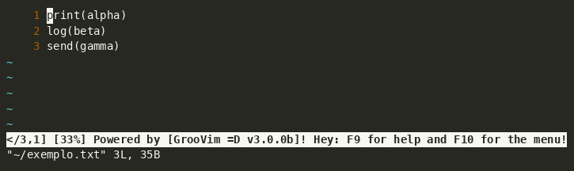
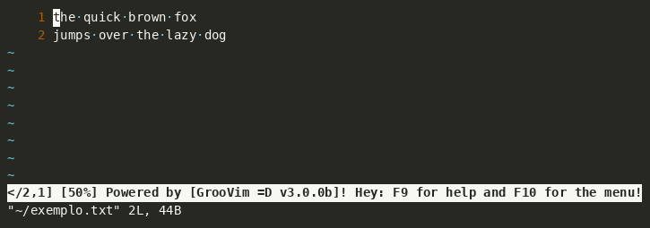
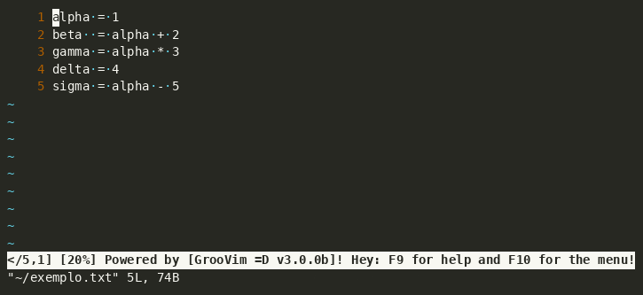
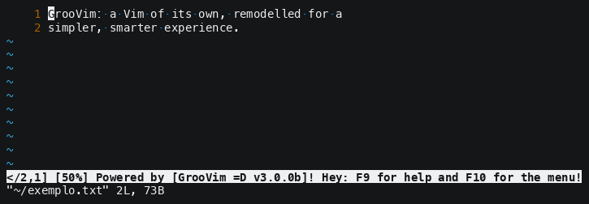

# The demos of GrooVim

Short GIFs, one idea each, made out of the scripts beside this file.

### Writing in several places at once

**F2 n** takes whole lines; **F2 m** takes places of their own, each at its own
column.



### The menu of F10

The map of the editor: the arrows walk it, an F key jumps to the section that F
key lives in, and Enter runs the line you are on.



### The occurrence list

**F3 f** searches and offers the word under the cursor. With the list switched
on -- **F5 c** and then `[s]` -- every line it is in comes up in a panel of its
own, and Enter goes there.



### A dialogue

The About, which is one: the buttons are walked with the arrows, the blue one is
pressed with Enter, the mouse clicks them, `c` copies what it says and the
address is a link.



```bash
./tools/make-demos.sh                 # all of them
./tools/make-demos.sh 01_multi_caret  # one, by name
```

## Why a script and not a recording

The same reason the battery exists. A GIF recorded by hand is true on the day it
was recorded and rots the first time the thing it shows changes -- and nobody
records it again, because recording it again means getting the timing right
again. These are pressed by a program: change the editor, run the command, and
the GIFs say what the editor says now.

`lib.py` opens a terminal of the size the GIF will have, runs GrooVim in it with
a home of its own -- no session of anybody's, nothing of the machine it was made
on -- presses the keys the script names and writes down everything the terminal
was sent, with the times. That file is an **asciicast**, and
[agg](https://github.com/asciinema/agg) turns it into the GIF.

**Not VHS**, which is what everybody uses for this: its tape language has no
`F1`..`F12`, and GrooVim IS the F keys. No Alt with the arrows either, and no
mouse. What is here presses anything a keyboard can send, because it sends the
bytes a keyboard sends.

## Writing one

```python
from lib import Demo

demo = Demo("02_menu", ["uma linha", "outra linha"], colunas=76, alturas=12)
demo.tecla("F10")                 # keys by name: F1..F12, arrows, Esc, S-Up...
demo.espera(1.0)                  # standing still is what lets the eye read
demo.tecla("Right", "Down")
demo.escreve("what a person types", por_tecla=0.09)
demo.fim()
```

Keep it to **one idea and around fifteen seconds**. The GIF everybody knows of
this kind -- the one of vim-visual-multi -- is 703x164, 31 frames and 61 KB: ten
lines of terminal, one feature, twelve seconds.

## What is kept

The scripts and the GIFs are in the repository. The `.cast` in between is not:
it is remade every time, and its times are of the run that made it.
